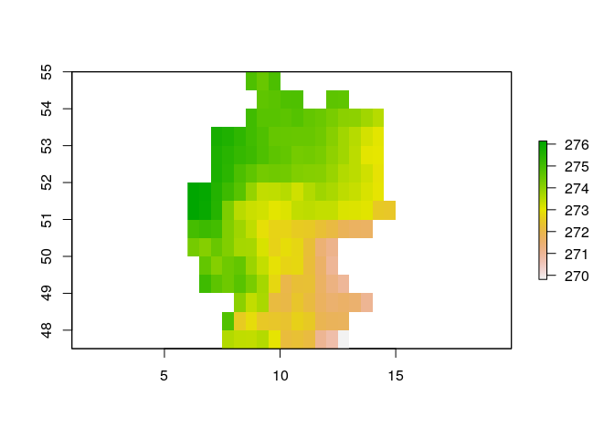
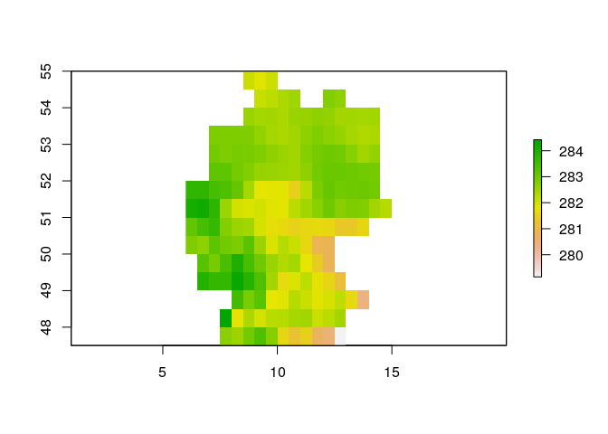

processNC - R Package for processing and analysing (large) NetCDF files
================
RS-eco
2019-09-30

## Overview

`processNC` is an R package for processing and analysing NetCDF files in
R. Small NetCDF files can easily be loaded into R using the `raster()`
function from the `raster` package in R, given that the `ncdf4` package
is installed. However, using this approach the entire file is read into
memory and so memory limits are reached quickly when trying to load
large NetCDF files.

The need for this package arised from the task to load large NetCDF
files with global daily climate data to calculate monthly or yearly
averages. With this package this task can be achieved without having to
read the entire file into memory.

For this, the package mainly consists of two functions:

  - `subsetNC()` subsets one or multiple NetCDF files by space (x,y),
    time and/or variable
  - `summariseNC()` summarises one or multiple NetCDF files over time
  - `cellstatsNC()` calculates the spatial mean of one or multiple
    NetCDF files

In addition, there is also a function called `summariseRaster`, which
allows a similar implementation to the `summariseNC` function, but using
raster files rather than NetCDF files.

There are also two functions (`mergeNC` and `aggregateNC`), which
together provide a much faster alternative to the `summariseNC`
function, but those functions rely on the Climate Data Operators (CDO)
software (<https://code.mpimet.mpg.de/projects/cdo>). This software
needs to be installed if you want to use those two functions in R.

## Installation

To *use* the package, it can be installed directly from GitHub using the
`remotes` package.

``` r
# If not yet installed, install the remotes package
if(!"remotes" %in% installed.packages()[,"Package"]) install.packages("remote")

# Download & Install the package from GitHub if not yet done so
if(!"processNC" %in% installed.packages()[,"Package"]) remotes::install_github("RS-eco/processNC", build_vignettes=T)
```

## Usage

Load processNC & raster package

``` r
library(processNC)
library(raster)
```

List NetCDF data files

``` r
# List daily temperature files for Germany from 1979 till 2013
files <- list.files(paste0(system.file(package="processNC"), "/extdata"), pattern=".nc", full.names=T)

# Show files
basename(files)
```

    [1] "tas_ewembi_deu_daily_1979_1980.nc" "tas_ewembi_deu_daily_1981_1990.nc"
    [3] "tas_ewembi_deu_daily_1991_2000.nc" "tas_ewembi_deu_daily_2001_2010.nc"
    [5] "tas_ewembi_deu_daily_2011_2016.nc"

Subset NetCDF file

``` r
# Subset NetCDF files by time and rough extent of Bavaria
subsetNC(files, ext=c(8.5, 14, 47, 51), startdate=1990, enddate=1999)
```

    class      : RasterStack 
    dimensions : 10, 6, 60, 3288  (nrow, ncol, ncell, nlayers)
    resolution : 0.9166667, 0.4  (x, y)
    extent     : 8.5, 14, 47, 51  (xmin, xmax, ymin, ymax)
    crs        : +proj=longlat +datum=WGS84 +no_defs +ellps=WGS84 +towgs84=0,0,0 
    names      : X1990.01.01, X1990.01.02, X1990.01.03, X1990.01.04, X1990.01.05, X1990.01.06, X1990.01.07, X1990.01.08, X1990.01.09, X1990.01.10, X1990.01.11, X1990.01.12, X1990.01.13, X1990.01.14, X1990.01.15, ... 
    min values :    268.2550,    269.4496,    269.9260,    268.7616,    269.0258,    269.5515,    266.3336,    266.5575,    267.9392,    268.0426,    268.6588,    267.2176,    268.5135,    268.0288,    269.4830, ... 
    max values :    272.5554,    272.0455,    272.0891,    272.1550,    273.2923,    274.2967,    272.8197,    273.3356,    274.3950,    273.8759,    274.0204,    273.8117,    272.9468,    274.2203,    275.7679, ... 

``` r
# Get SpatialPolygonsDataFrame of Bavaria
data(bavaria)

# Subset NetCDF file by SpatialPolygonDataFrame
subsetNC(files, ext=bavaria)
```

    class      : RasterBrick 
    dimensions : 9, 5, 45, 13880  (nrow, ncol, ncell, nlayers)
    resolution : 0.9727318, 0.3660113  (x, y)
    extent     : 8.975925, 13.83958, 47.27012, 50.56422  (xmin, xmax, ymin, ymax)
    crs        : +proj=longlat +datum=WGS84 +no_defs +ellps=WGS84 +towgs84=0,0,0 
    source     : /tmp/RtmpbOvTe2/raster/r_tmp_2019-09-30_122342_18370_21137.grd 
    names      : X1979.01.01, X1979.01.02, X1979.01.03, X1979.01.04, X1979.01.05, X1979.01.06, X1979.01.07, X1979.01.08, X1979.01.09, X1979.01.10, X1979.01.11, X1979.01.12, X1979.01.13, X1979.01.14, X1979.01.15, ... 
    min values :    258.5225,    259.2864,    262.5962,    261.2245,    259.8299,    261.2420,    262.6502,    266.7570,    269.9405,    269.7677,    270.7775,    269.8421,    268.8952,    267.8006,    265.1033, ... 
    max values :    265.4785,    262.7227,    265.5797,    263.6797,    261.9867,    263.5001,    265.7485,    270.3293,    273.8665,    272.1921,    272.2344,    271.9499,    270.9982,    269.5755,    267.8779, ... 

``` r
# Subset NetCDF file just by time
subsetNC(files, startdate=1990, enddate=1999)
```

    class      : RasterStack 
    dimensions : 17, 14, 238, 3288  (nrow, ncol, ncell, nlayers)
    resolution : 0.6071429, 0.4117647  (x, y)
    extent     : 6.25, 14.75, 47.75, 54.75  (xmin, xmax, ymin, ymax)
    crs        : +proj=longlat +datum=WGS84 +no_defs +ellps=WGS84 +towgs84=0,0,0 
    names      : X1990.01.01, X1990.01.02, X1990.01.03, X1990.01.04, X1990.01.05, X1990.01.06, X1990.01.07, X1990.01.08, X1990.01.09, X1990.01.10, X1990.01.11, X1990.01.12, X1990.01.13, X1990.01.14, X1990.01.15, ... 
    min values :    268.2550,    268.8760,    269.7884,    268.2937,    267.8489,    268.2939,    265.9402,    265.4810,    267.7947,    268.0426,    268.6028,    267.2176,    267.4866,    267.7701,    268.2850, ... 
    max values :    274.5740,    274.6320,    274.9313,    273.3459,    276.0111,    276.3013,    277.2385,    278.2452,    279.2395,    279.6846,    280.9291,    280.3109,    277.7491,    276.3155,    278.7222, ... 

Summarise NetCDF file

``` r
# Summarise daily NetCDF file for 10 years 
s <- summariseNC(files[4], startdate=2001, enddate=2010, group_col=c("month", "year"))
plot(s[[1]])
```

<!-- -->

``` r
# Summarise daily NetCDF files for all years
yearly_tas <- summariseNC(files, startdate=2001, enddate=2010, group_col="year")
plot(yearly_tas[[1]])
```

<!-- -->

``` r
# Calculate mean annual temperature for Germany
yearmean_tas <- as.data.frame(raster::cellStats(yearly_tas, stat="mean"))
colnames(yearmean_tas) <- "mean"
yearmean_tas <- tibble::rownames_to_column(yearmean_tas, var="year")
yearmean_tas$year <- sub("X", "", yearmean_tas$year)
yearmean_tas$mean <- yearmean_tas$mean - 273.15
head(yearmean_tas)
```

``` 
  year     mean
1 2001 9.327813
2 2002 9.823712
3 2003 9.659545
4 2004 9.237923
5 2005 9.365806
6 2006 9.975323
```

Summarise NetCDF file using CDO commands

  - Merge files:

<!-- end list -->

``` r
temp <- tempfile(fileext=".nc")
mergeNC(files=files, outfile=temp)
raster::stack(temp)
```

  - Aggregate files:

<!-- end list -->

``` r
temp2 <- tempfile(fileext=".nc")
aggregateNC(infile=temp, outfile=temp2, var="tas", startdate="2000", enddate="2009")
temp2 <- raster::stack(temp2)
plot(temp2[[1]])
```

Summarise Raster file

``` r
summariseRaster(files[4], startdate=2001, enddate=2010, var="tas")
```

CellStats NetCDF file

``` r
# Summarise daily NetCDF file for 10 years and show first 6 values
head(cellstatsNC(files, startdate=2000, enddate=2009))

# Summarise daily NetCDF files without time limit
mean_daily_temp <- cellstatsNC(files, stat="mean")

# Summarise annual mean temperature of Germany 
mean_daily_temp$year <- lubridate::year(mean_daily_temp$date)
mean_daily_temp$mean <- mean_daily_temp$mean - 273.15
mean_annual_temp <- aggregate(mean ~ year, mean_daily_temp, mean)
```
